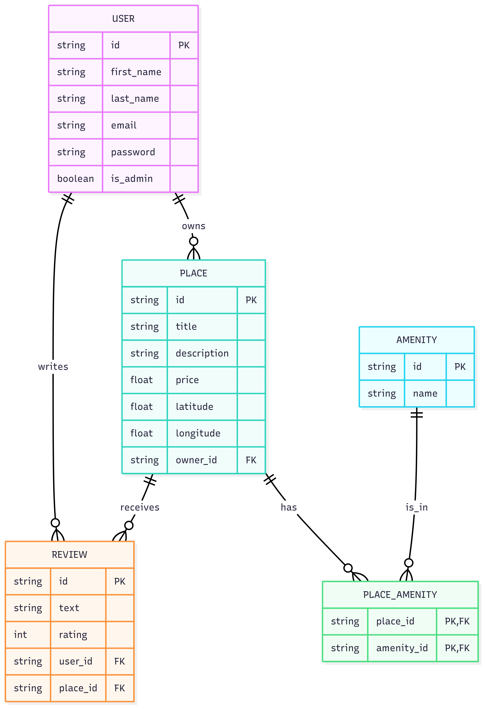

# HBnB RESTful API - Part 2

## ✨ Description

HBnB is a modular RESTful API built with Flask. It manages users, places, amenities, and reviews. This application is part two of the Holberton School HBnB project, focused on the presentation and business logic layers.

---

## 🛂 Main Features

* User management (registration, update, roles)
* Creation and display of places
* Amenity management (many-to-many)
* Adding reviews and ratings
* Relational MySQL database
* Automated testing with Pytest

---

## 📂 Project Structure

```
part2/
├── app/
│   ├── api/                # REST endpoints by version
│   ├── models/             # SQLAlchemy models
│   ├── persistence/        # Repository abstraction
│   ├── services/           # Business logic (facade)
│   └── test_models/        # Unit tests for models
├── test_database.py        # SQL integration tests
├── hbnb_db.sql             # Database schema
├── test.sql                # Test data
├── run.py                  # Application entry point
```

---
## 🧱 Technologies Used

Python 3.12

Flask + Flask-RESTx

PyMySQL for SQL tests

SQLite for quick testing, MySQL for production

Pytest for unit tests

Raw SQL for schema definition

---

## 🎓 SQLAlchemy Models

### 👤 User

```python
first_name: str (max 50)
last_name: str (max 50)
email: str (unique, max 120)
password_hash: str
is_admin: bool (default False)
```

* Passwords are hashed using `Flask-Bcrypt`
* `verify_password()` checks credentials

### 🏠 Place

```python
title: str (max 128)
description: str (max 500)
price: float
latitude, longitude: float
user_id: FK(User.id)
```

* Many-to-many relationship with `Amenity`
* One-to-many relationship with `Review`

### 🏨 Amenity

```python
name: str (unique, max 50)
```

### 📝 Review

```python
text: str (500)
rating: int (1-5)
place_id: FK(Place.id)
user_id: FK(User.id)
```

* Unique constraint: (user\_id, place\_id)

---

## 🧩 Entity-Relationship Diagram




---

## 📊 SQL Query Examples

```sql
SELECT * FROM User;
SELECT * FROM Place WHERE price > 200;
```
---

## 🤖 Sample Endpoints

```bash
GET /api/v1/places/<place_id>
POST /api/v1/users
```
---

## 🧰 Business Logic (Facade)

Located in `app/services/facade.py`, the `HBnBFacade` class centralizes operations:

* Creating and retrieving entities
* Linking models (add review to a place, etc.)
* Integrity checks before creation (user/place exists)

---

## 🔧 Running the Project

The `run.py` file sets up the Flask app and database:

```python
app = create_app()
with app.app_context():
    db.create_all()
app.run(debug=True)
```

```bash
git clone https://github.com/votre-utilisateur/holbertonschool-hbnb.git
cd holbertonschool-hbnb/part2
python3 -m venv venv
source venv/bin/activate
pip install -r requirements.txt
```

```bash
source venv/bin/activate
mysql -u root -p < hbnb_db.sql
mysql -u root -p hbnb_db < test.sql
python run.py
```

---

## 📚 Tests

### 🔬 Unit Tests with Pytest

File: `test_database.py`

* Checks for required tables
* Verifies admin user presence
* Validates foreign keys and constraints

```bash
pytest test_database.py
```
### Manual Tests with cURL

#### ✅ Create a User

```bash
curl -X POST http://127.0.0.1:5000/api/v1/users \
     -H "Content-Type: application/json" \
     -d '{
           "first_name": "Maxence",
           "last_name": "Potier",
           "email": "maxence.potier@example.com",
           "password": "securepassword123"
         }'

#### ✅ Auth/Login 

curl -X POST http://127.0.0.1:5000/api/v1/auth/login \
     -H "Content-Type: application/json" \
     -d '{
           "email": "maxence.potier@example.com",
           "password": "securepassword123"
         }'

Your backend should return a JSON with a JWT access token, for example:

{
  "access_token": "eyJ0eXAiOiJKV1QiLCJhbGciOi..."
}

#### 🔐 Example of a protected request using the token:

curl -X GET http://127.0.0.1:5000/api/v1/users \
     -H "Authorization: Bearer <access_token>"
```
---

## 📊 SQL Query Examples

```sql
SELECT * FROM User;
SELECT * FROM Place WHERE price > 50;
```

---

## 📓 Requirements

```txt
Flask
Flask-Bcrypt
SQLAlchemy
pymysql
pytest
```

Install dependencies with:

```bash
pip install -r requirements.txt
```

---

## 🎉 Authors

Project developed as part of Holberton School.


##Web & Mobile Developers:##

Haggui Razafimaitso
github: https://github.com/hagguishel

Julien Pulon
github: https://github.com/JulienPul
updated: 20/06/2025

---

## 📃 License

his project is part of the Holberton School curriculum and is intended for educational purposes only.
